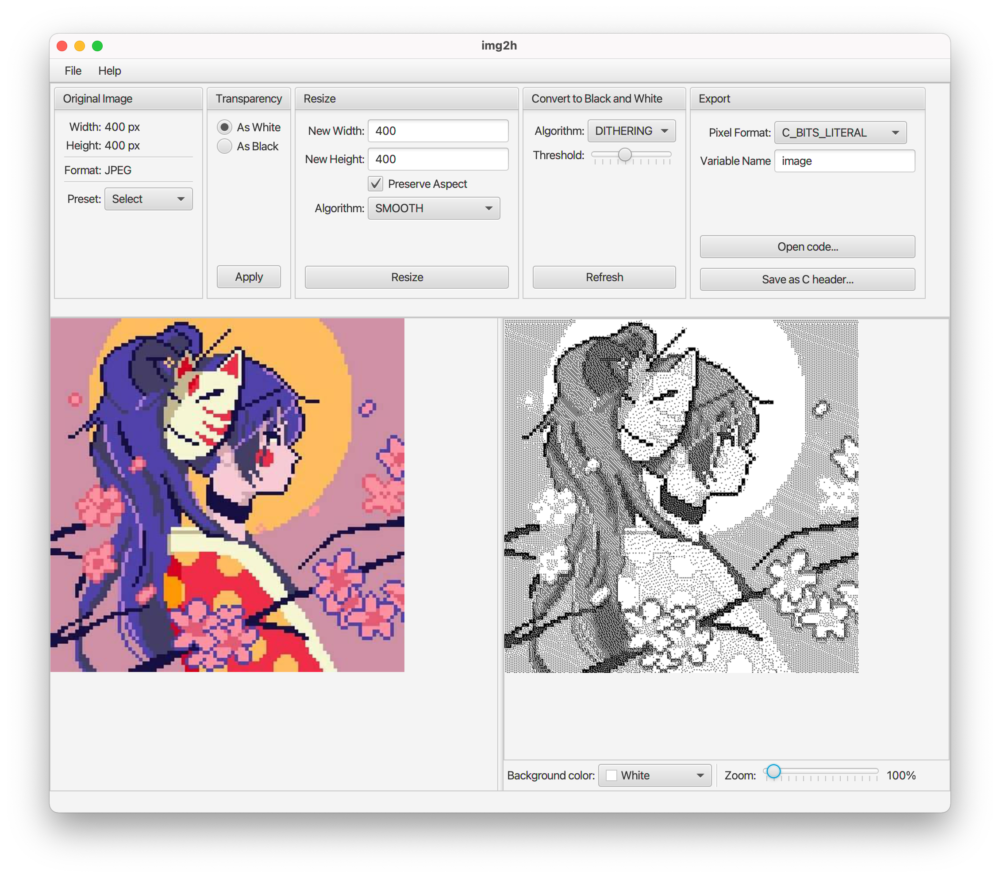
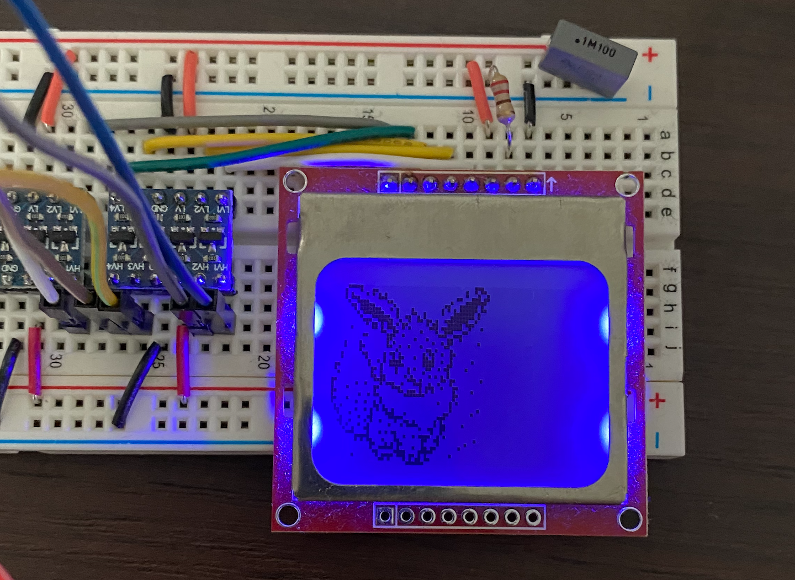
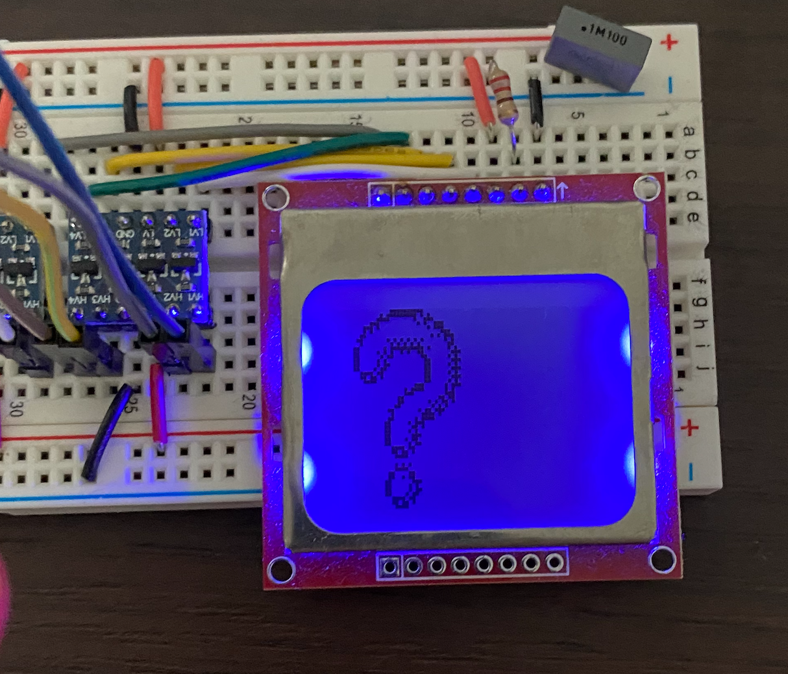
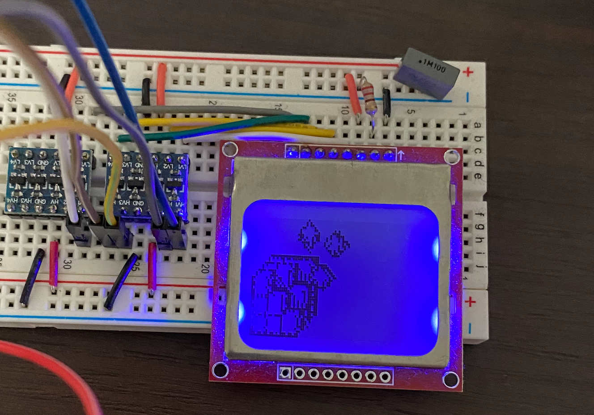

# img2h (Image to C Header)


This is a simple tool that allows you to convert
images and icons to Arduino's Adafruit GFX library format.



Example images created using this app:





## Download application

You can download the latest releases from repository [releases page](https://github.com/marcin-chwedczuk/img2h/releases).

### macOS

To install the application on macOS open `.dmg` file and drop the app to `/Applications` folder.
Next, you have to remove quarantine bits from the `.app` file to be able to run the app
(this is the only way to run the app without me having to pay $$$ for Apple dev account).

```
$ cd /Applications
$ sudo xattr -cr img2h.ap
$ open img2h.app
```

After this you will be able to start img2h app via Spotlight.

### Linux

Download the provided `.deb` file and install it via `dpkg`:
```
$ sudo dpkg -i img2h_1.0.0-1_amd64.deb
```
By default, the app will be installed in `/opt/img2h/`, you may need to add
it to `PATH` to use the app comfortably. 

To remove the app just execute:
```
$ sudo apt remove img2h
```

### Windows

TODO

## How to build application from sources

You need JDK 16 or newer to compile and run this application.
```
./mvnw clean package
./mvnw javafx:run -pl gui
```

(OK it should work on JDK 11 too, but I am running all CI builds on JDK 16.)

