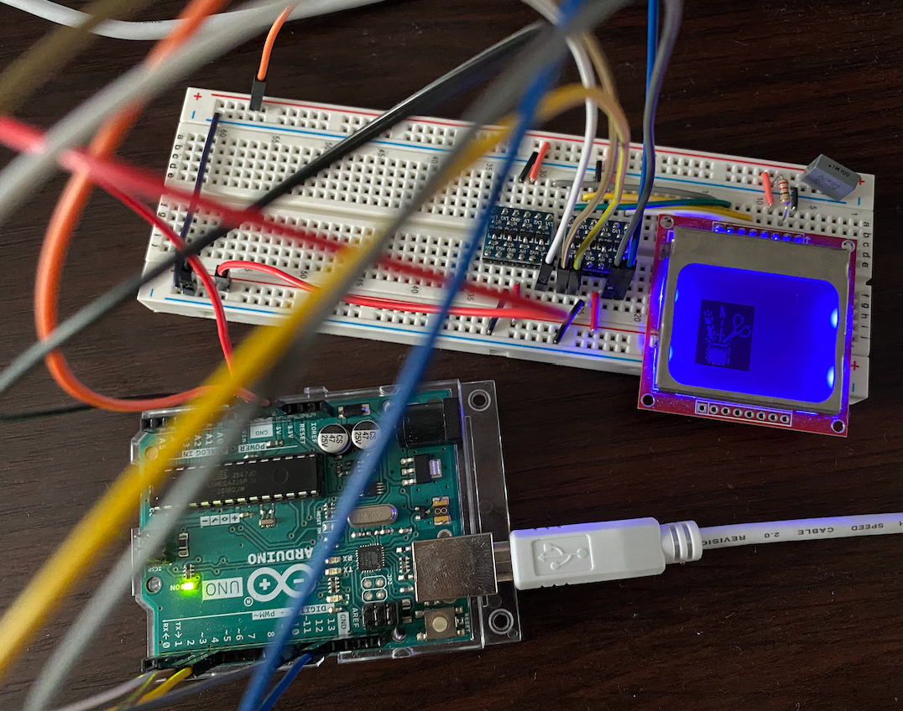

# JavaFX Opinionated Application Template


WORK IN PROGRESS.

This is a simple tool that allows you to convert
images and icons to Arduino's Adafruit GFX library format.




### How to run application

You need JDK 11 or newer to compile and run this application.
```
./mvnw clean package
./mvnw javafx:run -pl gui
```

